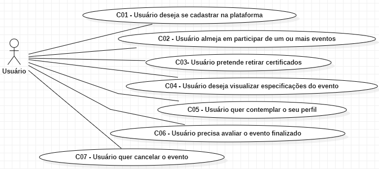
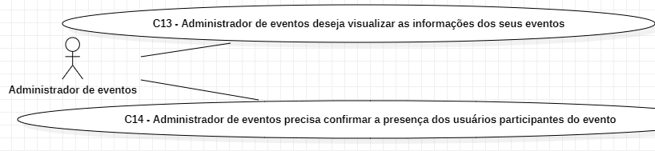

# Análise de Requisitos

### Processos de negócios

Os processos e os requisitos de negócios são descobertos
e expressos em `casos de uso`

# Casos de uso - Usuário:

## Caso de uso 01: Usuário deseja se cadastrar na plataforma

Descrição: Este caso de uso se inicializa quando o usuário decide se cadastrar na plataforma, para que ele possa realizar qualquer ação efetiva no sistema.

## Caso de uso 02: Usuário almeja participar de um ou mais eventos

Descrição: Este caso de uso se inicializa quando o usuário escolhe um evento e, caso possível, entra na lista de participantes.

## Caso de uso 03: Usuário pretende retirar certificados

Descrição: Este caso de uso se inicializa caso o usuário esteja apto para emitir um certificado, ele será notificado quando estiver pronto e poderá acessar o sistema para retirar.

## Caso de uso 04: Usuário deseja visualizar especificações do evento

Descrição: Este caso necessita que o usuário esteja cadastrado na plataforma e como participante de um evento para poder acessar as especificações de evento.

## Caso de uso 05: Usuário quer contemplar o seu perfil

Descrição: Este caso se inicializa quando o usuário acessa seu perfil para poder fazer ações de visualizar o perfil ou editar informações.

## Caso de uso 06: O usuário precisa avaliar o evento finalizado

Descrição: Este caso se inicializa quando o administrador do evento finaliza o evento e o usuário que pretende retirar o certificado, ele é obrigado a avaliar o evento.

## Caso de uso 07: O usuário quer cancelar o evento

Descrição: Este caso se inicializa quando o usuário deseja cancelar a inscrição em um evento.

# Casos de uso - Gestor de Eventos:

## Caso de uso 08: Gestor pretende editar evento

Descrição: Este caso se inicializa quando o gestor de eventos acessa o sistema, acessa um evento para editar algo sobre o evento.

## Caso de uso 09: Gestor cobiça em finalizar evento

Descrição: Este caso se inicializa após o gestor confirmar a relação de presenças dos participantes para que ele possa finalizar o evento.

## Caso de uso 10: Gestor quer enviar os certificados

Descrição: Este caso de uso se inicializa após o C07 e o Gestor informará ao sistema os alunos que estão aptos para receber o certificado e então enviará.

## Caso de uso 11: Gestor deseja cadastrar evento na plataforma

Descrição: Este caso de uso se inicializa quando um Gestor de eventos for realizar um evento e faz o cadastro na plataforma para que usuários possam se cadastrar.

## Caso de uso 12: Gestor deseja observar a lista de eventos cadastrados na plataforma de eventos

Descrição: Este caso de uso se inicializa quando o gestor for acessar a lista de eventos cadastrador na plataforma de eventos

# Casos de uso - Administrador

## Caso de uso 13: Administrador de eventos deseja visualizar as informações do seu evento

Descrição: Este caso de uso ocorre quando o administrador deseja visualizar as informações do evento em que ele é o dono.

## Caso de uso 14: Administrador precisa confirmar a presença dos usuários participantes do evento

Descrição: Este caso de uso consiste no administrador fazendo e confirmando a relação dos alunos presentes e ausentes no evento.
